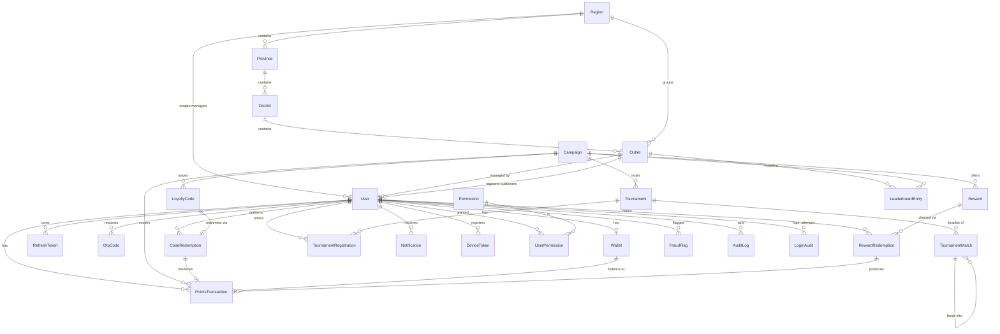

# Database Design — Amstel Rewards Platform

PostgreSQL 16 · Prisma · normalized · soft-deletes · audit trail.
Source of truth: [`apps/api/prisma/schema.prisma`](../apps/api/prisma/schema.prisma).

## Conventions
- **UUID** primary keys (`@db.Uuid`, `uuid()` default).
- **snake_case** table names via `@@map`; camelCase in the Prisma client.
- **Soft deletes** via `deletedAt` on long-lived entities (users, outlets,
  campaigns, rewards, tournaments, regions). Query helper: `prisma.notDeleted`.
- **Audit**: `AuditLog` (append-only, before/after JSON) + `LoginAudit`.
- **Money** as `Decimal(14,2)`; **points** as `BigInt` (lifetime totals can grow large).
- **Indexes** on every foreign key and hot query path.

## Entity-relationship diagram



## Domain groupings

**Identity & access** — `User`, `Permission`, `UserPermission`,
`RefreshToken`, `OtpCode`, `LoginAudit`, `DeviceToken`.

**Geography** — `Region › Province › District › Outlet`. Outlets denormalize
`regionId`/`provinceId`/`districtId` for fast scoped queries. One manager per
outlet (1:1); customers reference the outlet they registered through.

**Campaigns** — `Campaign` owns codes, rewards, tournaments and configures
`pointsPerCode` + `pointsExpiryDays`.

**Loyalty ledger** — `LoyaltyCode` (one-time, `codeHash` unique + `codeCipher`
encrypted) → `CodeRedemption` (unique `codeId` enforces single use) →
`PointsTransaction` (signed, immutable ledger) → `Wallet` (derived balances).

**Rewards** — `Reward` (type/inventory/cost/validity) → `RewardRedemption`
(approval workflow) → `PointsTransaction` (debit).

**Tournaments** — `Tournament` → `TournamentRegistration` (unique per user) and
`TournamentMatch` (self-referential `nextMatchId` models the bracket).

**Leaderboards** — `LeaderboardEntry` materialized snapshots keyed by
`(type, period, subject, campaign)`, recomputed by a scheduled job; live ranks
served from Redis sorted sets.

**Notifications** — `Notification`, `NotificationPreference`, `DeviceToken`.

**Anti-fraud & audit** — `FraudFlag` (severity + status review queue),
`AuditLog`, `LoginAudit`.

## Integrity highlights
- One-time code use: **two** guarantees — `CodeRedemption.codeId @unique` and a
  conditional `updateMany(where status=ACTIVE)` inside a Serializable tx.
- Wallet never drifts: balance mutations and ledger rows are written atomically.
- Refresh-token reuse detection via the `family` column.
- `@@unique([tournamentId, userId])` blocks double tournament entry.

## Migrations
```bash
pnpm db:generate   # prisma client
pnpm db:migrate    # create/apply dev migration
pnpm db:seed       # demo data + printable sample codes
pnpm db:studio     # browse data
```
